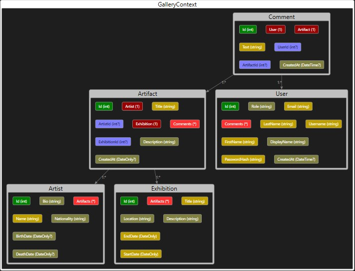

# MyGalleryApi 🎨

This project is an ASP.NET Core Web API for managing an online art gallery, including users, artists, exhibitions, artifacts, and comments.

## 🗂️ Database Schema

The database structure has been designed using PostgreSQL with proper normalization and relationships between entities such as:

- Users
- Artists
- Artifacts
- Exhibitions
- Comments

### 📊 Database Diagram

Below is a visual representation of the database schema:

> The diagram illustrates entity relationships, foreign keys, and important fields.

## 🛠 Technologies Used

- ASP.NET Core 8
- Entity Framework Core
- PostgreSQL + PostGIS
- EF Core Power Tools (for reverse engineering)

## 📦 Setup

1. Clone the repo
2. Run migrations or use the included database
3. Run the API using `dotnet run`

---
